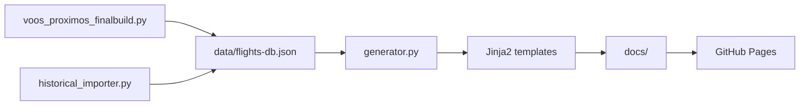

# Arquitetura MatchFly (Estado Atual)

**Versão:** 2.0  
**Última atualização:** Fevereiro 2026

Este documento descreve a arquitetura atual do projeto: fluxo de dados, geração de páginas estáticas e publicação via GitHub Pages a partir da pasta `/docs`.

---

## 1. Visão geral do fluxo

```
┌─────────────────────────────────────────────────────────────────────────────┐
│                           FONTES DE DADOS                                    │
├─────────────────────────────────────────────────────────────────────────────┤
│  • voos_proximos_finalbuild.py  → CSV/API → data/flights-db.json             │
│  • src/historical_importer.py   → ANAC SIROS → merge em flights-db.json      │
│  • data/specificroutes_anac.json (rotas ANAC para enriquecimento)           │
└─────────────────────────────────────────────────────────────────────────────┘
                                        │
                                        ▼
┌─────────────────────────────────────────────────────────────────────────────┐
│  data/flights-db.json  (banco único: voos, metadados, timestamps)            │
└─────────────────────────────────────────────────────────────────────────────┘
                                        │
                                        ▼
┌─────────────────────────────────────────────────────────────────────────────┐
│  src/generator.py  (Python)                                                 │
│  • Carrega JSON                                                              │
│  • Enriquecimento (enrichment.py, scl_corrections, IATA)                      │
│  • Filtros (cancelados, atrasados, etc.)                                     │
│  • Renderização Jinja2 (templates em src/templates/)                          │
│  • Saída: docs/ (HTML, sitemap.xml, robots.txt, CNAME, .nojekyll, 404.html)   │
└─────────────────────────────────────────────────────────────────────────────┘
                                        │
                                        ▼
┌─────────────────────────────────────────────────────────────────────────────┐
│  docs/                                                                       │
│  • index.html, cidades.html, cancelados.html, atrasados.html, privacy.html  │
│  • voo/*.html (páginas por voo)                                              │
│  • destino/*.html (páginas por cidade)                                       │
│  • sitemap.xml, robots.txt, CNAME, .nojekyll, 404.html                        │
└─────────────────────────────────────────────────────────────────────────────┘
                                        │
                                        ▼
┌─────────────────────────────────────────────────────────────────────────────┐
│  GitHub Pages  (Source: branch main, folder /docs)                           │
│  • Domínio custom: CNAME em docs/ → matchfly.org                            │
└─────────────────────────────────────────────────────────────────────────────┘
```

---

## 2. Diagrama de alto nível (Mermaid)



---

## 3. Estrutura de pastas do projeto

```
matchfly-pseo/
├── .github/
│   └── workflows/
│       └── update-flights.yml    # CI: sync data → generator → commit docs/
├── data/
│   ├── flights-db.json          # Banco principal de voos (entrada do generator)
│   ├── specificroutes_anac.json # Rotas ANAC (enriquecimento)
│   └── *.xls                    # Dados ANAC (percentuais, etc.)
├── docs/                         # Saída do generator = site publicado
│   ├── CNAME                    # matchfly.org (domínio custom GitHub Pages)
│   ├── .nojekyll                # Bypass Jekyll
│   ├── 404.html
│   ├── index.html
│   ├── cidades.html, cancelados.html, atrasados.html, privacy.html
│   ├── sitemap.xml, robots.txt
│   ├── voo/                     # Páginas por voo
│   └── destino/                 # Páginas por cidade
├── src/
│   ├── generator.py             # Gerador de páginas estáticas (output_dir=docs)
│   ├── enrichment.py            # Enriquecimento de destinos (IATA, ANAC)
│   ├── scl_corrections.py       # Correções de destino (ex.: viés SCL)
│   ├── historical_importer.py    # Importação histórica ANAC
│   ├── indexer.py                # Google Indexing API (opcional)
│   ├── scrapers/
│   │   ├── gru_flights_scraper.py
│   │   ├── gru-scraper.py
│   │   └── gru_proximos/        # Scraper modular (Playwright)
│   └── templates/
│       ├── base.html, index.html, tier2-anac400.html
│       ├── 404.html, atrasados.html, cancelados.html, cidades.html, privacy.html
│       ├── components/, includes/
│       └── ...
├── _internal_docs/               # Documentação interna (não publicada)
├── _archive/                     # Scripts e artefatos antigos
├── voos_proximos_finalbuild.py   # Sync de dados (usado pelo CI)
├── run_pipeline.sh               # Pipeline local opcional
├── requirements.txt
└── README.md
```

---

## 4. Generator (src/generator.py) – Resumo do workflow

| Step | Descrição |
|------|-----------|
| 1. Setup & Validação | Affiliate link, criação de `docs/` e `docs/voo/`, escrita de `CNAME` e `.nojekyll` |
| 2. Initial Cleanup | Remove `docs/index.html` antigo; contagem de arquivos em `docs/voo/` |
| 3. Carga e enriquecimento | Carrega `data/flights-db.json`; enriquecimento de destinos (ANAC, IATA) |
| 3.1 | Renderização resiliente: uma página por voo em `docs/voo/` |
| 3.2 | Gestão de órfãos (preservação para SEO, sem remoção agressiva) |
| 3.7 | Páginas de cidade (`docs/destino/`), índice `docs/cidades.html` |
| 3.8 | `docs/privacy.html`, `docs/404.html` |
| 3.3 | `docs/sitemap.xml`, `docs/robots.txt` |
| 3.4 | `docs/index.html` (home com Flip Cards / Split-Flap por cidade) |
| 3.5–3.6 | Smart Ticker, páginas de categoria (cancelados, atrasados) |
| 4 | Log final e estatísticas |

O diretório de saída é **sempre `docs/`** (configurável via `output_dir` e `voo_dir` no construtor; padrão `docs` e `docs/voo`).

---

## 5. Stack tecnológico

| Camada | Tecnologia |
|--------|------------|
| Dados | JSON (flights-db), CSV/ANAC, pandas quando aplicável |
| Geração | Python 3.12, Jinja2, python-slugify |
| Front-end | HTML estático, Tailwind CSS (CDN), JavaScript (Lucide icons, interações) |
| Hosting | GitHub Pages (branch main, folder /docs) |
| CI/CD | GitHub Actions (update-flights.yml): Python 3.12, pip, voos_proximos_finalbuild, generator, commit docs/ |

---

## 6. Infraestrutura em docs/ (GitHub Pages)

| Arquivo | Função |
|---------|--------|
| `CNAME` | Contém `matchfly.org`; necessário para domínio custom no GitHub Pages quando a fonte é a pasta `/docs`. |
| `.nojekyll` | Arquivo vazio; desativa o processamento Jekyll para que pastas/arquivos com `_` não sejam ignorados. |
| `404.html` | Página de erro customizada; gerada pelo generator a partir do template base. |
| `sitemap.xml` | Gerado pelo generator; listado em `robots.txt`. |
| `robots.txt` | Gerado pelo generator; aponta para `Sitemap: https://matchfly.org/sitemap.xml`. |

---

## 7. Referências

- Deploy e CI: `_internal_docs/DEPLOY.md`
- Guia do gerador: `_internal_docs/GENERATOR_GUIDE.md`
- Configuração do repositório: GitHub → Settings → Pages → Source: main, folder **/docs**
