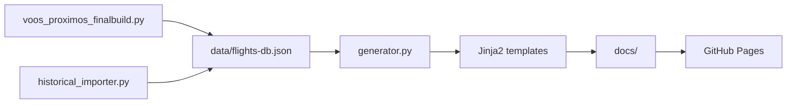

# MatchFly Architecture (Current State)

**Version:** 2.0  
**Last updated:** February 2026

This document describes the current project architecture: data flow, static page generation, and publishing via GitHub Pages from the `/docs` folder.

---

## 1. Flow Overview

```
┌─────────────────────────────────────────────────────────────────────────────┐
│                           DATA SOURCES                                       │
├─────────────────────────────────────────────────────────────────────────────┤
│  • voos_proximos_finalbuild.py  → CSV/API → data/flights-db.json             │
│  • src/historical_importer.py   → ANAC SIROS → merge into flights-db.json    │
│  • data/specificroutes_anac.json (ANAC routes for enrichment)                │
└─────────────────────────────────────────────────────────────────────────────┘
                                        │
                                        ▼
┌─────────────────────────────────────────────────────────────────────────────┐
│  data/flights-db.json  (single database: flights, metadata, timestamps)      │
└─────────────────────────────────────────────────────────────────────────────┘
                                        │
                                        ▼
┌─────────────────────────────────────────────────────────────────────────────┐
│  src/generator.py  (Python)                                                 │
│  • Loads JSON                                                               │
│  • Enrichment (enrichment.py, scl_corrections, IATA)                        │
│  • Filters (cancelled, delayed, etc.)                                        │
│  • Jinja2 rendering (templates in src/templates/)                           │
│  • Output: docs/ (HTML, sitemap.xml, robots.txt, CNAME, .nojekyll, 404.html) │
└─────────────────────────────────────────────────────────────────────────────┘
                                        │
                                        ▼
┌─────────────────────────────────────────────────────────────────────────────┐
│  docs/                                                                       │
│  • index.html, cidades.html, cancelados.html, atrasados.html, privacy.html  │
│  • voo/*.html (pages per flight)                                            │
│  • destino/*.html (pages per city)                                          │
│  • sitemap.xml, robots.txt, CNAME, .nojekyll, 404.html                      │
└─────────────────────────────────────────────────────────────────────────────┘
                                        │
                                        ▼
┌─────────────────────────────────────────────────────────────────────────────┐
│  GitHub Pages  (Source: branch main, folder /docs)                           │
│  • Custom domain: CNAME in docs/ → matchfly.org                             │
└─────────────────────────────────────────────────────────────────────────────┘
```

---

## 2. High-Level Diagram (Mermaid)



---

## 3. Project Folder Structure

```
matchfly-pseo/
├── .github/
│   └── workflows/
│       └── update-flights.yml    # CI: sync data → generator → commit docs/
├── data/
│   ├── flights-db.json          # Main flight database (generator input)
│   ├── specificroutes_anac.json # ANAC routes (enrichment)
│   └── *.xls                    # ANAC data (percentages, etc.)
├── docs/                         # Generator output = published site
│   ├── CNAME                    # matchfly.org (custom domain GitHub Pages)
│   ├── .nojekyll                # Bypass Jekyll
│   ├── 404.html
│   ├── index.html
│   ├── cidades.html, cancelados.html, atrasados.html, privacy.html
│   ├── sitemap.xml, robots.txt
│   ├── voo/                     # Pages per flight
│   └── destino/                 # Pages per city
├── src/
│   ├── generator.py             # Static page generator (output_dir=docs)
│   ├── enrichment.py            # Destination enrichment (IATA, ANAC)
│   ├── scl_corrections.py       # Destination corrections (e.g.: SCL bias)
│   ├── historical_importer.py   # Historical ANAC import
│   ├── indexer.py               # Google Indexing API (optional)
│   ├── scrapers/
│   │   ├── gru_flights_scraper.py
│   │   ├── gru-scraper.py
│   │   └── gru_proximos/        # Modular scraper (Playwright)
│   └── templates/
│       ├── base.html, index.html, tier2-anac400.html
│       ├── 404.html, atrasados.html, cancelados.html, cidades.html, privacy.html
│       ├── components/, includes/
│       └── ...
├── _internal_docs/               # Internal documentation (not published)
├── _archive/                     # Old scripts and artifacts
├── voos_proximos_finalbuild.py   # Data sync (used by CI)
├── run_pipeline.sh               # Optional local pipeline
├── requirements.txt
└── README.md
```

---

## 4. Generator (src/generator.py) – Workflow Summary

| Step | Description |
|------|-------------|
| 1. Setup & Validation | Affiliate link, creation of `docs/` and `docs/voo/`, writing `CNAME` and `.nojekyll` |
| 2. Initial Cleanup | Removes old `docs/index.html`; counts files in `docs/voo/` |
| 3. Load and enrichment | Loads `data/flights-db.json`; destination enrichment (ANAC, IATA) |
| 3.1 | Resilient rendering: one page per flight in `docs/voo/` |
| 3.2 | Orphan management (preservation for SEO, no aggressive removal) |
| 3.7 | City pages (`docs/destino/`), index `docs/cidades.html` |
| 3.8 | `docs/privacy.html`, `docs/404.html` |
| 3.3 | `docs/sitemap.xml`, `docs/robots.txt` |
| 3.4 | `docs/index.html` (home with Flip Cards / Split-Flap by city) |
| 3.5–3.6 | Smart Ticker, category pages (cancelled, delayed) |
| 4 | Final log and statistics |

The output directory is **always `docs/`** (configurable via `output_dir` and `voo_dir` in the constructor; default `docs` and `docs/voo`).

---

## 5. Tech Stack

| Layer | Technology |
|-------|------------|
| Data | JSON (flights-db), CSV/ANAC, pandas when applicable |
| Generation | Python 3.12, Jinja2, python-slugify |
| Front-end | Static HTML, Tailwind CSS (CDN), JavaScript (Lucide icons, interactions) |
| Hosting | GitHub Pages (branch main, folder /docs) |
| CI/CD | GitHub Actions (update-flights.yml): Python 3.12, pip, voos_proximos_finalbuild, generator, commit docs/ |

---

## 6. Infrastructure in docs/ (GitHub Pages)

| File | Function |
|------|----------|
| `CNAME` | Contains `matchfly.org`; required for custom domain on GitHub Pages when source is `/docs` folder. |
| `.nojekyll` | Empty file; disables Jekyll processing so folders/files with `_` are not ignored. |
| `404.html` | Custom error page; generated by generator from base template. |
| `sitemap.xml` | Generated by generator; listed in `robots.txt`. |
| `robots.txt` | Generated by generator; points to `Sitemap: https://matchfly.org/sitemap.xml`. |

---

## 7. References

- Deploy and CI: `_internal_docs/DEPLOY.md`
- Generator guide: `_internal_docs/GENERATOR_GUIDE.md`
- Repository configuration: GitHub → Settings → Pages → Source: main, folder **/docs**
